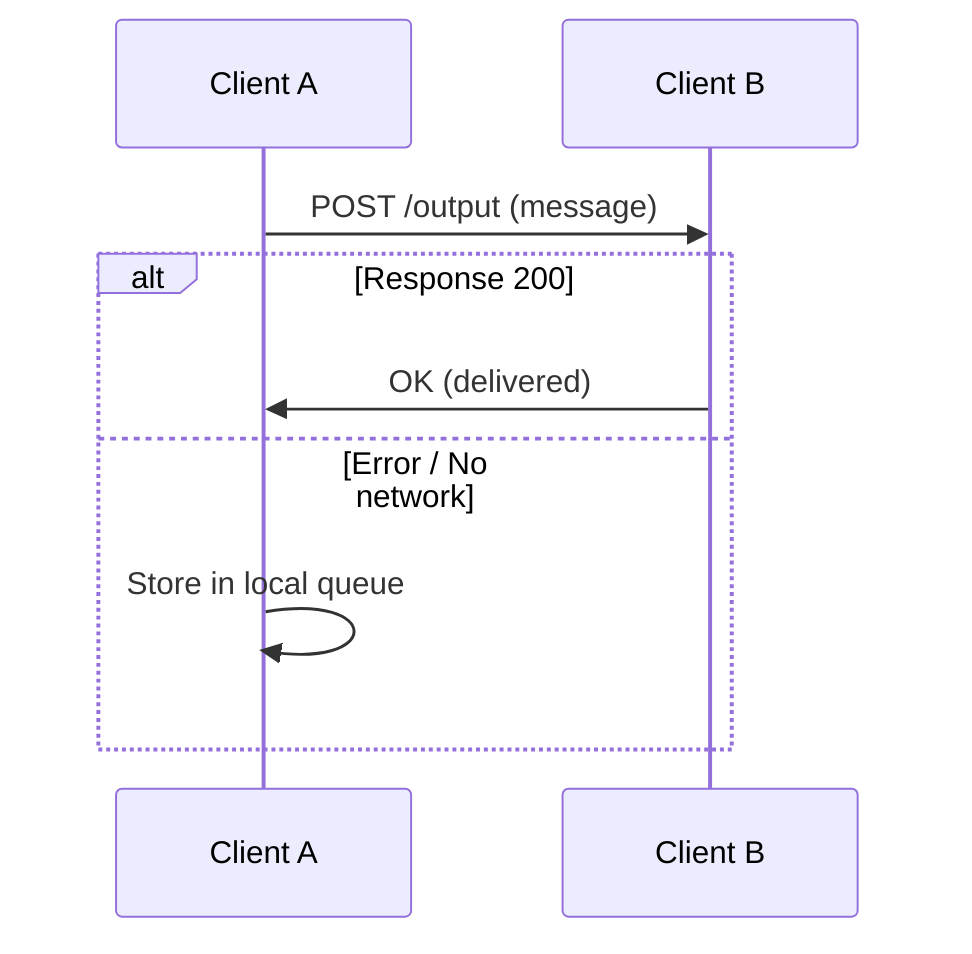
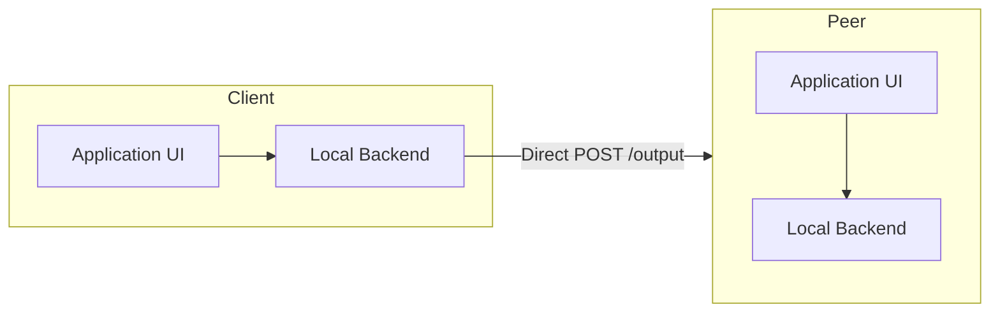

# [Pure2P](https://pure2p.com)

**True and Pure P2P Messenger**

---

## 📖 Overview
Pure2P is a **radically honest P2P messenger**:
- **No servers, no relays, no DHT neighbors, no push services.**
- Each client = **application + minimal local backend**.
- Communication happens **directly between peers**.
- All history and state are stored **locally only** — no sync, no external storage.

---

## 👤 Account Model
- A unique **UID** is generated upon account creation.
- UID is shared **manually** (via any external channel).
- Adding a contact = entering their UID.
- After the first successful message exchange, a **chat binding (UID ↔ UID)** is established.

---

## 📬 Message Delivery Mechanics
- Each client exposes a **POST endpoint**: `/output`.
- Sending flow:
  1. Client tries `POST → peer`.
  2. If response ≠ 200 → message is queued locally for retry.
  3. Delivery happens **only when both peers are online**.

---

## 🟢 Online Presence & Address Discovery
- Upon launch, a client sends **POST requests to all active peers**.
- Each request contains:
  - Online status marker.
  - Current network address (if updated).
- This way peers learn when messages can be delivered.

---

## 💾 Data Storage Model
- Each user stores **only their own data**:
  - Sent + unsent messages → sender’s device.
  - Received messages → recipient’s device.
- **Device loss = history loss** (expected behavior).
- No global UID search, only manual exchange.

---

## ⚖️ Privacy vs. Limitations

### ✅ Advantages
- No servers → no metadata leaks.
- No relays → no third-party visibility.
- No cloud buffers.
- No trust in operators or intermediaries.

### ⚠️ Limitations
- **Delivery delays**: requires simultaneous online presence.
- **No push notifications** (mobile OS require central push services).
- Sleeping devices = unreachable.
- Device loss = history loss.

---

## 📱 Mobile & Desktop Constraints
- Mobile OS (iOS, Android): apps **cannot wake up** on external request.
- Notification = only when user **manually launches the app**, and peer is online.
- Desktop: suspended/sleeping devices are equally unavailable.

---

## 🚫 No Compromises
Pure2P **intentionally rejects** common trade-offs:
- No DHTs, bootstrap servers, or neighbor relaying.
- No trusted push gateways.
- Unlike Signal, Telegram, Matrix — Pure2P removes server reliance entirely.

---

## 🏗️ Architecture Overview

---

## 🎯 Conclusion

Pure2P is a **radically honest messenger**:
- **Absolute privacy** through strict P2P design.
- **No intermediaries, no trust assumptions.**
- The trade-off: **reduced convenience** — delivery delays, no push, no cloud history.

---

## 📄 License

MIT License - see [LICENSE](LICENSE) for details.

---

**[Website](https://pure2p.com)** • **[Documentation](https://pure2p.com/docs)** • **[Community](https://pure2p.com/community)**

Made with privacy in mind 🔒

