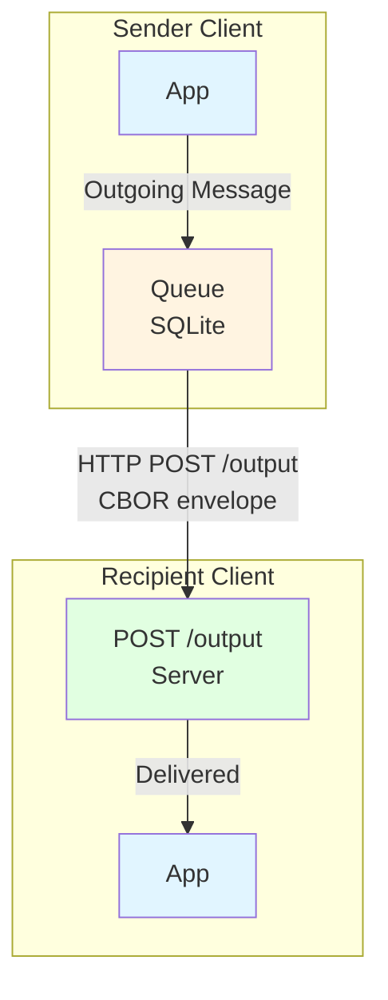
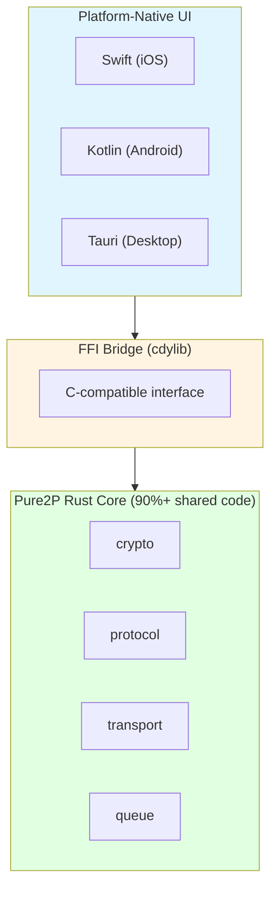

<div align="center">

# [Pure2P](https://pure2p.com)

**True and Pure P2P Messenger**

[](LICENSE)
[]()
[]()

*Direct peer-to-peer messaging with no servers, no relays, no compromises.*

[Quick Start](QUICKSTART.md) • [Development](DEVELOPMENT.md) • [Roadmap](ROADMAP.md)

</div>

---

## 📖 Overview

Pure2P is a **radically honest P2P messenger** that prioritizes privacy over convenience.

### Core Principles

- ✅ **Direct P2P only**: No servers, relays, DHT, or push services
- ✅ **Local-only storage**: No sync, no cloud — device loss means history loss
- ✅ **Manual contact exchange**: UIDs shared through external channels
- ✅ **Online-only delivery**: Messages require simultaneous peer presence

### What This Means

**You Get:**
- Absolute privacy — no metadata leaks
- No trust in operators or intermediaries
- Full control of your data

**You Accept:**
- Delivery delays (both peers must be online)
- No push notifications
- Manual peer management
- No message history if device is lost

---

## 🚀 Quick Start

Get started in 5 minutes with the CLI prototype:

```bash
# Install Rust (if needed)
curl --proto '=https' --tlsv1.2 -sSf https://sh.rustup.rs | sh

# Build and run
git clone https://github.com/yourusername/pure2p.git
cd pure2p
cargo run --bin pure2p-cli
```

**See [QUICKSTART.md](QUICKSTART.md) for detailed CLI usage and your first P2P message tutorial.**

---

## 🏗️ How It Works

### Architecture



### Message Flow

1. **Send**: Client POSTs message to peer's `/output` endpoint
2. **Success**: Peer responds 200 → message delivered
3. **Failure**: Message queued locally with exponential backoff
4. **Retry**: Queue attempts delivery when peer comes online

### Key Components

- **Crypto**: Ed25519 keypairs, SHA-256 UID derivation
- **Protocol**: CBOR-serialized message envelopes
- **Transport**: HTTP/1.1 server with `/output`, `/ping`, and `/message` endpoints
- **Queue**: SQLite-backed retry queue with exponential backoff and startup retry
- **Storage**: Contact tokens, chat structures, and application state persistence

**See [DEVELOPMENT.md](DEVELOPMENT.md) for architecture details and [CLAUDE.md](CLAUDE.md) for implementation notes.**

---

## 💻 Platform Support

### Current (v0.1)

| Platform | Status | Notes |
|----------|--------|-------|
| **macOS** | ✅ | CLI client (Intel + Apple Silicon) |
| **Linux** | ✅ | CLI client (x86_64 + ARM64) |
| **Windows** | ✅ | CLI client (x86_64) |
| **Android** | 🔄 | Core library ready, GUI pending |
| **iOS** | 🔄 | Core library ready, GUI pending |

### Architecture



**Planned:**
- v0.2 (Q2 2025): Storage, encryption, rich messages ([ROADMAP.md](ROADMAP.md#-version-02---enhanced-core-q2-2025))
- v0.3 (Q3 2025): Desktop GUI with Tauri ([ROADMAP.md](ROADMAP.md#-version-03---desktop-clients-q3-2025))
- v0.4 (Q4 2025): Mobile apps (iOS/Android) ([ROADMAP.md](ROADMAP.md#-version-04---mobile-clients-q4-2025))

**See [ROADMAP.md](ROADMAP.md) for complete version timeline.**

---

## 📚 Documentation

- **[Quick Start Guide](QUICKSTART.md)** - Get the CLI running in 5 minutes
- **[Development Guide](DEVELOPMENT.md)** - Architecture, message format, API docs
- **[Roadmap](ROADMAP.md)** - Version timeline and planned features

---

## 🎯 Current Status (v0.1)

### Implemented ✅

- Ed25519 keypairs and UID generation
- CBOR message serialization
- HTTP transport with POST `/output`
- SQLite message queue with retry
- Cross-platform CLI client (macOS, Linux, Windows)

### Limitations ⚠️

- No encryption (plaintext payloads) — planned for v0.2
- No persistent storage — planned for v0.2
- No NAT traversal — planned for v0.5 ([ROADMAP.md](ROADMAP.md#-version-05---nat-traversal-q1-2026))
- Manual peer management
- Text messages only — rich media in v0.2

**This is a prototype for testing the P2P architecture. See [ROADMAP.md](ROADMAP.md) for planned features.**

---

## 🤝 Contributing

Pure2P welcomes contributions that align with our core principles.

### How to Contribute

1. **Discuss**: Open an issue to discuss your idea
2. **Develop**: Fork, create feature branch, make changes
3. **Test**: Run `cargo test` and `cargo clippy` (see [DEVELOPMENT.md](DEVELOPMENT.md#code-quality))
4. **Submit**: Create pull request with clear description

See [DEVELOPMENT.md](DEVELOPMENT.md) for setup instructions and development workflow.

### Philosophy First

All contributions must maintain Pure2P's core values:
- ✅ Direct P2P communication only
- ✅ No servers, relays, or intermediaries
- ✅ Local-only storage and state
- ✅ Transparency about limitations

---

## 🎯 Why Pure2P?

### The Problem

Modern messengers compromise privacy:
- **Signal/WhatsApp**: Centralized servers see metadata (who talks to whom, when)
- **Telegram/Matrix**: Federation still requires trust in servers
- **Peer apps with relays**: "P2P" apps that secretly use relay servers

### The Solution

Pure2P makes a different trade-off:
- **You get**: Absolute privacy, no trust required, full data control
- **You accept**: Delivery delays, no push, manual setup

**Pure2P is for those who value privacy over convenience.**

---

## 📄 License

MIT License - see [LICENSE](LICENSE) for details.

---

<div align="center">

**[Quick Start](QUICKSTART.md)** • **[Development](DEVELOPMENT.md)** • **[Roadmap](ROADMAP.md)**

Made with privacy in mind 🔒

</div>
